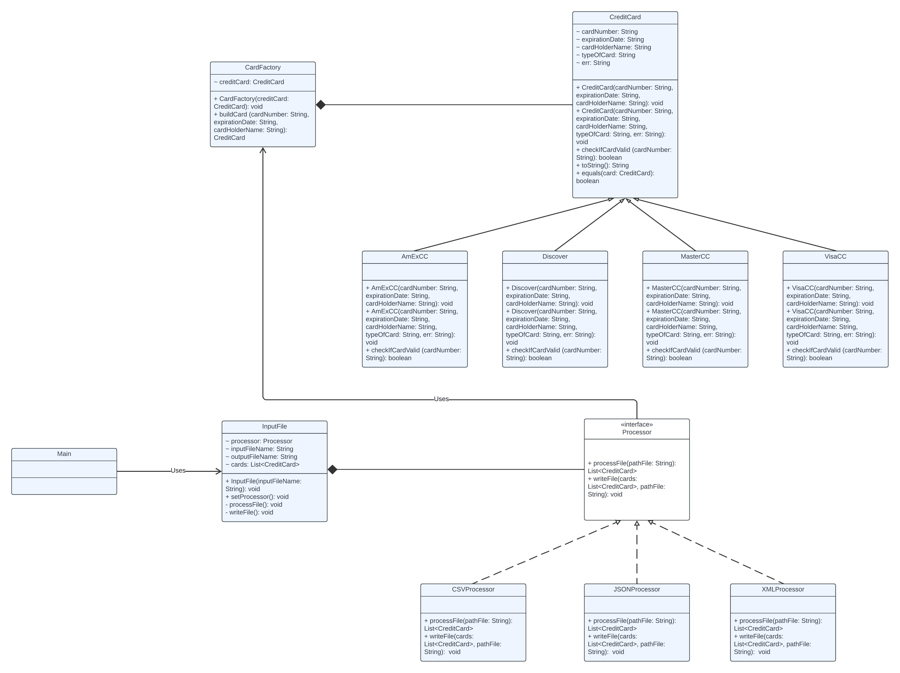

# Aishwarya Shankar's Individual Project (Fall 2023)

## Primary Problem
The primary problem that needs to be solved is to determine what type of card is represented by a record in the input file and accordingly create a card of that type (AmEX, Discover, MasterCard, Visa, etc...).
### Approach to Solve Primary Problem
I used the factory method design pattern to solve the primary problem because this creational pattern allows us to dynamically create objects whose type you don't initially know. I implemented this by creating a CardFactory class which is utilized to check records in the input file at runtime and create the appropriate type of credit card.
### Advantages and Disadvantages of Using Factory Method Design Pattern
Advantages
+ Supports Single Responsibility Principle by making one class in charge of creating the appropriate object
+ Supports Open/Closed Principle because it allows you to add new object types as needed

Disadvantages
+ Subclasses needed for new object types that you introduce, which can result in many subclasses

## Secondary Problem
The secondary problem that needs to be solved is to determine the input file type and write the relevant card information to an output file in the same format as the input file (CSV, JSON, XML, etc...).
### Approach to Solve Secondary Problem
I used strategy design pattern to solve the secondary problem because it is a behavioral pattern which allows you to select a "strategy" (in this case, the type of file processor) to use at runtime. I implemented this by creating a Processor interface consisting of 2 methods (processFile and writeFile), 3 classes (CSVProcessor, JSONProcessor, and XMLProcessor) which implement the Processor interface and are in charge of processing the corresponding type of input file and writing to the appropriate output file in the desired format, and an InputFile class which takes in the input file name at runtime, determines the file format, holds a reference to the type of processor which needs to be used, and then invokes that processor's processFile and writeFile methods. 
### Advantages and Disadvantages of Using Strategy Design Pattern
Advantages
+ Dynamically choose strategy at runtime
+ Support Open/Closed Principle because you can introduce new "strategies" but don't need to modify the context class

Disadvantages
+ If we only have a few different "strategies" (in this case, processing methods for different types of files), then strategy pattern could overcomplicate the code

## UML Class Diagram

